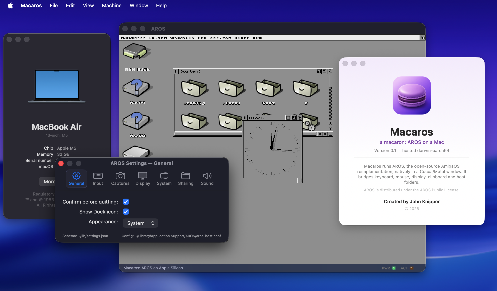

# Macaros

Macaros packages [AROS](https://aros.org), the open-source AmigaOS-compatible
operating system, as a native Apple Silicon Mac application. AROS runs as an
arm64 process, presents the Wanderer desktop in a Cocoa/Metal window, and uses
macOS for display, sound, networking, clipboard, and access to shared files.



Macaros is not an emulator for one historic Amiga model. It is a hosted build
of AROS itself, compiled for AArch64 and integrated with the Mac.

It is also a test bed for our own AROS concepts. A bare-metal Apple Silicon
version is not planned; macOS deliberately remains the hardware-facing host.

## What it can do

- Boot the full Wanderer desktop in a resizable native window.
- Exchange clipboard contents with macOS.
- Play audio through CoreAudio and use the Mac's network connection.
- Mount `~/AROS/Shared` as writable `MacRW:` and read-only `MacRO:` volumes.
- Decode common media formats and accelerate the display path with Metal.
- Run native AArch64 AROS applications, including the bundled Zed editor and
  Ferail file manager.
- Run a growing set of classic 68k applications through the included JIT.
- Be driven and inspected without a person at the keyboard through `aros-ctl`.

The normal release includes Zed and Ferail. Moonstone is deliberately excluded
from the public release; developers can restore it for a private build with
`MACAROS_INCLUDE_MOONSTONE=1` after providing its binary and assets.

## Repository boundary

This repository owns the Macaros product and integration layer:

```
graft/       build, deployment, control, compatibility, and release tools
harness/     unattended QEMU and hosted test harnesses
hosted/      macOS host bridges, AROS-side integration experiments, and JIT
docs/        current feature docs, project records, and the initial bring-up archive
```

The original standalone QEMU kernel and Phase 1/Phase 2 notes now live under
[`docs/hosted/initial-platform-bringup/`](docs/hosted/initial-platform-bringup/README.md).
They are retained as a working reference for adding AROS support to another
platform, not as the current Macaros implementation plan.

The source projects remain separate so their histories and responsibilities do
not become tangled:

- [jonx/AROS](https://github.com/jonx/AROS/tree/aarch64-darwin-graft) is the
  working AROS source fork containing the active AArch64/Darwin port.
- [jonx/AROS-AArch64](https://github.com/jonx/AROS-AArch64) is retained as a
  redirect to this repository so old links and history remain understandable.
- [jonx/zed-aros](https://github.com/jonx/zed-aros) and
  [jonx/Ferail](https://github.com/jonx/Ferail) develop the bundled apps.

Do not publish changes to the AROS upstream project without first discussing
the exact change with John and receiving explicit approval. This rule is also
recorded in [AGENTS.md](AGENTS.md) for future work in this checkout.

For a concise document to give existing collaborators after the repository
split, see [docs/project/COLLABORATOR-GUIDE.md](docs/project/COLLABORATOR-GUIDE.md).

## Requirements

- An Apple Silicon Mac
- macOS 12 or newer
- Xcode Command Line Tools and Homebrew
- A sibling checkout of the `aarch64-darwin-graft` branch of `jonx/AROS`

The complete source-build path is in
[GETTING-STARTED.md](GETTING-STARTED.md). A typical checkout layout is:

```text
Source/
├── Macaros/
├── aros-upstream/    jonx/AROS, branch aarch64-darwin-graft
├── zed-aros/
└── Ferail/
```

Code built for this hosted target must not use Apple platform register `x18`.
Use `-ffixed-x18` for C/C++, the checked-in Rust target with `+reserve-x18`, and
avoid `x18` in assembly. [RELEASE-NOTES.md](RELEASE-NOTES.md) explains the
Darwin signal/preemption failure that makes this mandatory.

After the AROS runtime has been built and staged, the principal commands are:

```sh
make cocoametal-dylib pasteboard-dylib coreaudio-dylib bsdsock-dylib
graft/aros-ctl deploy
AROS_CTL_STARTUP_MODE=desktop graft/run-window.sh
graft/make-aros-app.sh
```

The unattended controller can then boot, type, click, capture the framebuffer,
and inspect the guest:

```sh
graft/aros-ctl run
graft/aros-ctl wait 3
graft/aros-ctl type "echo hello"
graft/aros-ctl enter
graft/aros-ctl shot
graft/aros-ctl stop
```

## Building a release candidate

The release process is documented in [RELEASE.md](RELEASE.md). To create an
unsigned internal candidate:

```sh
MACAROS_VERSION=0.2.0 MACAROS_BUILD_NUMBER=2 \
  graft/make-aros-release.sh --dmg
```

The disk image includes a short README and a double-clickable compatibility
checker. Signing, notarization, and publishing are separate steps and happen
only after the exact unsigned candidate has been tested.

## Security and licences

Macaros is experimental systems software. Review [SECURITY.md](SECURITY.md)
before exposing important data through a writable shared volume.

The integration code is distributed under the AROS Public License 1.1; bundled
projects and dependencies retain their own licences. See [LICENSE](LICENSE),
[THIRD-PARTY-NOTICES.md](THIRD-PARTY-NOTICES.md), and the generated material in
`notices/`.
